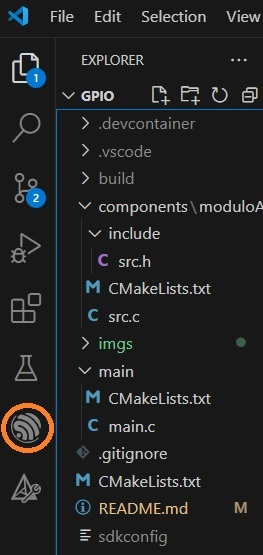

# _Ejemplo simple: gpio blink y uso de modulos externos_

En ese ejemplo se realizo el parpadeo de un led en la placa de desarrollo con el ESP32.


Recuerde el flujo de trabajo para utilizar este repositorio es:
-   **Compilar** el codigo del proyecto
-   **Flashear** el codigo en la placa
-   **Monitorizar** el puerto utilizado y ver los mensajes que se envian desde el microcontrolador.


## Como usar el ejemplo 
Una vez instalado el extension ESP-IDF-explorer en Visual studio Code iniamos el plugin haciendo click en la barra lateral irquierda.



Luego nos manejamos con el menu inferior.


-   ESP-IDF: Build project
-   ESP-IDF: Flash Device
-   ESP-IDF: Monitor

## Contenido de las carpetas

Este proyecto tiene un formato de distribución de directorios que permite realizar una aplicación principal (dentro de la carpeta 'main') que esté basada en piezas de código con diseño modular llamadas componentes.

ESP-IDF utiliza un sistema de compilación (building) basado en CMake, una herramienta que utiliza archivos de nombre `CMakeLists.txt` para configurar el proceso.

A continuación se presenta el formato de distribución de carpetas de este proyecto.


```
├── CMakeLists.txt                  Configuracion del proyecto
├── main
│   ├── CMakeLists.txt              Configuracion del main
│   └── main.c
├── components                      Componentes externos
|   ├── moduloA                     Modulo A
|       ├── CMakeLists.txt          Configuracion del moduloA
│       ├── include                 Carpeta con archivos .h
│       |   └── src.h           
│       └── src.c                   Codigo fuente del modulo
└── README.md                       Estas leyendo este archivo
```


### Configurar el autocompletado:

La documentacion para configurar el autocompletado es [documentacion](https://code.visualstudio.com/docs/cpp/c-cpp-properties-schema-reference#_example-of-variables). Resumen: necesitas un archivo `c_cpp_properties.json` en tu carpeta de trabajo con la siguiente configuracion

```
{
    "configurations": [
        {
            "name": "ESP-IDF",
            "compilerPath": "${config:idf.toolsPath}/tools/xtensa-esp-elf/esp-13.2.0_20230928/xtensa-esp-elf/bin/xtensa-esp32-elf-gcc",
            "compileCommands": "${workspaceFolder}/build/compile_commands.json",
            "includePath": [
                "${config:idf.espIdfPath}/components/**",
                "${config:idf.espIdfPathWin}/components/**",
                "${config:idf.espAdfPath}/components/**",
                "${config:idf.espAdfPathWin}/components/**",
                "${workspaceFolder}/**"
            ],
            "browse": {
                "path": [
                    "${config:idf.espIdfPath}/components",
                    "${config:idf.espIdfPathWin}/components",
                    "${config:idf.espAdfPath}/components/**",
                    "${config:idf.espAdfPathWin}/components/**",
                    "${workspaceFolder}"
                ],
                "limitSymbolsToIncludedHeaders": false
            }
        }
    ],
    "version": 4
}
```

